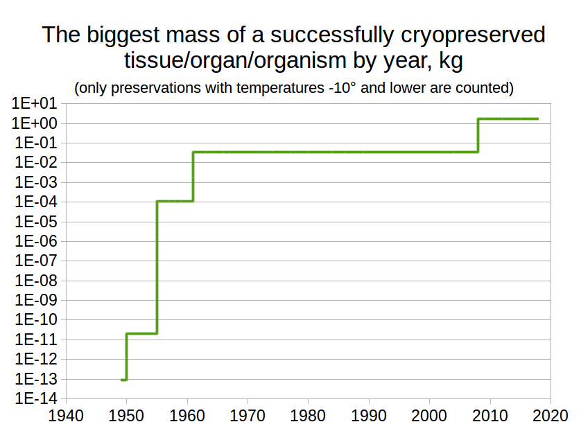
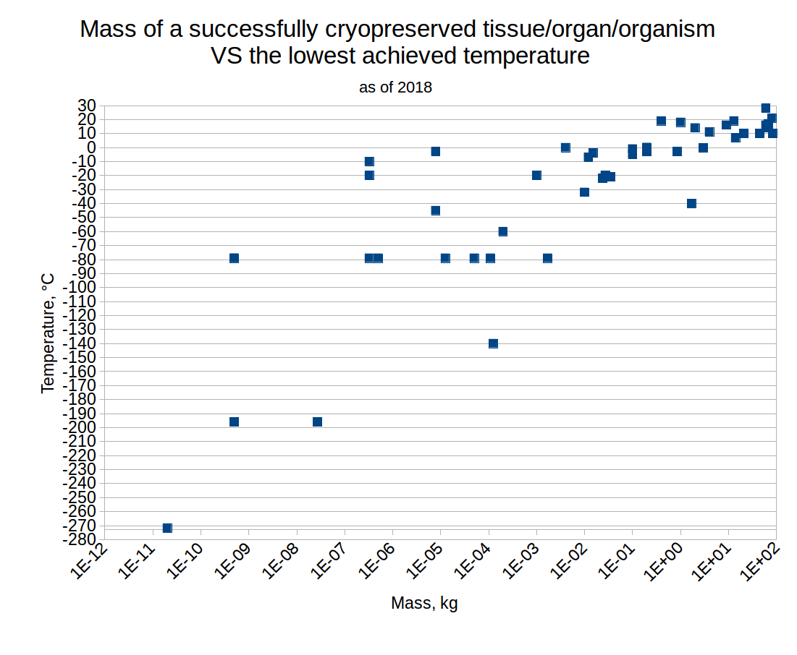

# Scientific progress towards cryonics

Below is a list of 70+ scientific papers that are related to cryonics. 

Feel free to use the table and the diagrams for any purposes, including commercial ones. Everything in this repository is released under a permissive [MIT](https://github.com/RomanPlusPlus/scientific-progress-towards-cryonics/blob/master/LICENSE) license. 

Some stats: 

# The papers

|	Year	|	Taxon	|	tissue, organ or whole body?	|	Approx. mass, kg	|	Lowest temperature (°C) after which a successful reanimation was achieved	|	Healthy brain activity / behavior after reanimation?	|	Reference	|	Useful link	|
|	-------------	|	-------------	|	-------------	|	-------------	|	-------------	|	-------------	|	-------------	|	-------------	|
|	1876	|	Guinea pig (C. porcellus)	|	whole	|	1E+00	|	18	|	Unknown	|	Bernard, 1876	|	https://nyaspubs.onlinelibrary.wiley.com/doi/abs/10.1111/j.1749-6632.1959.tb49209.x	|
|	1881	|	Marmots (Marmota)	|	whole	|	3E+00	|	0	|	Likely yes (adapted to hibernation)	|	Horvath, 1881	|	https://nyaspubs.onlinelibrary.wiley.com/doi/abs/10.1111/j.1749-6632.1959.tb49209.x	|
|	1912	|	Schreibers' bat (M. schreibersii)	|	whole	|	2E-02	|	-4	|	Unknown	|	Bachmetiev, 1912	|	http://priroda.ras.ru/ (1912 05)	|
|	1933	|	Bats (Chiroptera)	|	whole	|	4E-03	|	0	|	Unknown	|	Eisentraut, 1933	|	https://www.jstor.org/stable/1376212?seq=1#page_scan_tab_contents	|
|	1949	|	Human: unnamed donors	|	red blood cells	|	9E-14	|	-79	|	Irrelevant - no brain tissue	|	Smith et al, 1949	|	https://www.nature.com/articles/164666a0	|
|	1949	|	Human: unnamed donors	|	spermatozoa	|	3E-15	|	-79	|	Irrelevant - no brain tissue	|	Polge et al, 1949	|	https://www.ncbi.nlm.nih.gov/pubmed/18143360?dopt=Abstract	|
|	1950	|	Tardigrades (Tardigrada)	|	whole	|	2E-11	|	-272	|	Unknown	|	Becquerel, 1950	|	https://www.nature.com/articles/ncomms12808	|
|	1951	|	Human: unnamed 23yo woman 	|	whole	|	6E+01	|	16	|	Yes (no abnormalities observed)	|	Laufmann, 1951	|	https://jamanetwork.com/journals/jama/article-abstract/312807	|
|	1951	|	Brown rat (R. norvegicus)	|	whole	|	2E-01	|	0	|	Unknown	|	Andjus, 1951	|	https://nyaspubs.onlinelibrary.wiley.com/doi/abs/10.1111/j.1749-6632.1959.tb49209.x	|
|	1952	|	European rabbit (O. cuniculus)	|	skin	|	<0,1	|	-150	|	Irrelevant - no brain tissue	|	Billingham, Medawar, 1952	|	http://jeb.biologists.org/content/29/3/454.short	|
|	1953	|	Primate: lemur C. major	|	whole	|	4E-01	|	19	|	Unknown	|	Bourliere et al, 1953	|	https://nyaspubs.onlinelibrary.wiley.com/doi/abs/10.1111/j.1749-6632.1959.tb49209.x	|
|	1955	|	House mouse (M. musculus)	|	spleen	|	1E-04	|	-79	|	Irrelevant - no brain tissue	|	Barnes,Loutit, 1955	|	https://academic.oup.com/jnci/article-abstract/15/4/901/915080	|
|	1955	|	Brown rat (R. norvegicus)	|	whole	|	2E-01	|	-3	|	Unknown	|	Andjus, 1955	|	https://www.ncbi.nlm.nih.gov/pmc/articles/PMC1365903/	|
|	1956	|	Brown rat (R. norvegicus)	|	whole	|	2E-01	|	0	|	Yes (no abnormalities observed)	|	Andjus, 1956	|	https://nyaspubs.onlinelibrary.wiley.com/doi/abs/10.1111/j.1749-6632.1959.tb49209.x	|
|	1956	|	Golden hamster (M. auratus) 	|	whole	|	1E-01	|	-1	|	Yes (no abnormalities observed)	|	Lovelock, Smith, 1956	|	https://www.ncbi.nlm.nih.gov/pubmed/13359396	|
|	1957	|	Mammals (Mammalia)	|	ovarian tissue	|	5E-10	|	-79	|	Irrelevant - no brain tissue	|	Fahy, 1980	|	https://www.sciencedirect.com/science/article/pii/0011224080900449	|
|	1957	|	Primate: some Simiiformes	|	whole	|	4E+00	|	11	|	Yes (habits preserved, no abnormalities)	|	Niazi and Lewis, 1957	|	https://journals.lww.com/surveyanesthesiology/citation/1957/12000/profound_hypothermia_in_the_monkey_with_recovery.1.aspx	|
|	1957	|	Brown rat (R. norvegicus)	|	sup. сervic. ganglion	|	5E-07	|	-79	|	full recovery of synaptic function	|	Pascoe, Parkes, 1957	|	https://royalsocietypublishing.org/doi/abs/10.1098/rspb.1957.0071	|
|	1958	|	Mammals (Mammalia)	|	renal tissue	|	<0,1	|	-79	|	Irrelevant - no brain tissue	|	Fahy, 1980	|	https://www.sciencedirect.com/science/article/pii/0011224080900449	|
|	1958	|	Leisler's bat (N. leisleri)	|	whole	|	1E-02	|	-7	|	Unknown	|	Kalabukhov, 1958	|	https://nyaspubs.onlinelibrary.wiley.com/doi/abs/10.1111/j.1749-6632.1959.tb49209.x	|
|	1959	|	Mammals (Mammalia)	|	thyroid tissue	|	<0,1	|	-79	|	Irrelevant - no brain tissue	|	Fahy, 1980	|	https://www.sciencedirect.com/science/article/pii/0011224080900449	|
|	1959	|	Golden hamster (M. auratus) 	|	whole	|	1E-01	|	-5	|	Unknown	|	Andjus, 1959	|	https://nyaspubs.onlinelibrary.wiley.com/doi/abs/10.1111/j.1749-6632.1959.tb49209.x	|
|	1959	|	European rabbit (O. cuniculus)	|	whole	|	2E+00	|	14	|	Unknown	|	Andjus, 1959	|	https://nyaspubs.onlinelibrary.wiley.com/doi/abs/10.1111/j.1749-6632.1959.tb49209.x	|
|	1959	|	Human: brain surgery patients	|	whole	|	6E+01	|	28	|	Likely yes (a standard praxis in 2018)	|	Soleimanpour et al, 2014	|	https://www.ncbi.nlm.nih.gov/pmc/articles/PMC4166101/	|
|	1961	|	Mammals (Mammalia)	|	adrenal cortex	|	<0,1	|	-79	|	Irrelevant - no brain tissue	|	Fahy, 1980	|	https://www.sciencedirect.com/science/article/pii/0011224080900449	|
|	1961	|	Mammals (Mammalia)	|	epididymis	|	<0,1	|	-79	|	Irrelevant - no brain tissue	|	Fahy, 1980	|	https://www.sciencedirect.com/science/article/pii/0011224080900449	|
|	1961	|	Mammals (Mammalia)	|	fallopian tube	|	<0,1	|	-79	|	Irrelevant - no brain tissue	|	Fahy, 1980	|	https://www.sciencedirect.com/science/article/pii/0011224080900449	|
|	1961	|	Mammals (Mammalia)	|	hypophysis	|	<0,1	|	-79	|	Irrelevant - no brain tissue	|	Fahy, 1980	|	https://www.sciencedirect.com/science/article/pii/0011224080900449	|
|	1961	|	Mammals (Mammalia)	|	parathyroid glands	|	<0,1	|	-79	|	Irrelevant - no brain tissue	|	Fahy, 1980	|	https://www.sciencedirect.com/science/article/pii/0011224080900449	|
|	1961	|	Mammals (Mammalia)	|	prostate gland (ps.)	|	<0,1	|	-79	|	Irrelevant - no brain tissue	|	Fahy, 1980	|	https://www.sciencedirect.com/science/article/pii/0011224080900449	|
|	1961	|	Mammals (Mammalia)	|	seminal vesicles	|	<0,1	|	-79	|	Irrelevant - no brain tissue	|	Fahy, 1980	|	https://www.sciencedirect.com/science/article/pii/0011224080900449	|
|	1961	|	Mammals (Mammalia)	|	testicular tissue	|	<0,1	|	-79	|	Irrelevant - no brain tissue	|	Fahy, 1980	|	https://www.sciencedirect.com/science/article/pii/0011224080900449	|
|	1961	|	Golden hamster (M. auratus) 	|	heart	|	1E-03	|	-20	|	Irrelevant - no brain tissue	|	Smith, 1961	|	https://www.cabdirect.org/cabdirect/abstract/19620102256	|
|	1961	|	European rabbit (O. cuniculus)	|	heart	|	4E-02	|	-21	|	Irrelevant - no brain tissue	|	Connaughton, Lewis, 1961	|	https://www.ncbi.nlm.nih.gov/pubmed/27072955	|
|	1961	|	Guinea pig (C. porcellus)	|	uteri	|	2E-03	|	-79	|	Irrelevant - no brain tissue	|	Smith, 1961	|	https://www.sciencedirect.com/science/article/pii/0011224080900449	|
|	1963	|	Domestic dog (C. lupus f.)	|	ureters	|	<0,1	|	-79	|	Irrelevant - no brain tissue	|	Barner et al, 1963	|	https://www.sciencedirect.com/science/article/pii/0011224080900449	|
|	1964	|	House mouse (M. musculus)	|	thymus glands	|	5E-05	|	-79	|	Irrelevant - no brain tissue	|	Playfair et al, 1964	|	https://www.sciencedirect.com/science/article/pii/0011224080900449	|
|	1966	|	Cat (Felis catus)	|	brain (in vitro)	|	3E-02	|	-20	|	ECG similar to the control	|	I. Suda et al, 1966	|	https://www.nature.com/articles/212268a0	|
|	1967	|	Domestic dog (C. lupus f.)	|	small intestine	|	<0,1	|	-79	|	Irrelevant - no brain tissue	|	Hailmton, Lehr, 1967	|	https://www.sciencedirect.com/science/article/pii/0011224080900449	|
|	1972	|	Mammals (Mammalia)	|	heart (fetal)	|	<0,1	|	-79	|	Irrelevant - no brain tissue	|	Fahy, 1980	|	https://www.sciencedirect.com/science/article/pii/0011224080900449	|
|	1973	|	Domestic dog (C. lupus f.)	|	kidney	|	2E-02	|	-22	|	Irrelevant - no brain tissue	|	Dietzman et al, 1973	|	https://www.ncbi.nlm.nih.gov/pubmed/27072955	|
|	1974	|	Mammals (Mammalia)	|	bone marrow	|	<0,1	|	-79	|	Irrelevant - no brain tissue	|	Fahy, 1980	|	https://www.sciencedirect.com/science/article/pii/0011224080900449	|
|	1974	|	Cat (Felis catus)	|	brain (in vitro)	|	3E-02	|	-20	|	activity, but some ECG abnormalities	|	I. Suda et al, 1974	|	https://www.sciencedirect.com/science/article/pii/0006899374902637	|
|	1974	|	Mammals (Mammalia)	|	cornea	|	<0,1	|	-79	|	Irrelevant - no brain tissue	|	Fahy, 1980	|	https://www.sciencedirect.com/science/article/pii/0011224080900449	|
|	1974	|	Mammals (Mammalia)	|	skin	|	<0,1	|	-79	|	Irrelevant - no brain tissue	|	Fahy, 1980	|	https://www.sciencedirect.com/science/article/pii/0011224080900449	|
|	1977	|	Mammals (Mammalia)	|	embryos	|	5E-10	|	-79	|	Unknown	|	Fahy, 1980	|	https://www.sciencedirect.com/science/article/pii/0011224080900449	|
|	1977	|	Brown rat (R. norvegicus)	|	pancreases (fetal)	|	<0,1	|	-79	|	Irrelevant - no brain tissue	|	Fahy, 1980	|	https://www.sciencedirect.com/science/article/pii/0011224080900449	|
|	1980	|	Brown rat (R. norvegicus)	|	fetal brain tissue	|	<0,1	|	-90	|	Successful transplantation into a rat brain	|	Houle, Das, 1980	|	https://www.sciencedirect.com/science/article/pii/0006899380909099	|
|	1983	|	Human: unnamed donors	|	brain tissue	|	<0,1	|	-70	|	Metabolically, functionally active synapses	|	Hardy et al, 1983	|	https://onlinelibrary.wiley.com/doi/abs/10.1111/j.1471-4159.1983.tb08024.x	|
|	1984	|	Salamander S. keyserlingii	|	whole	|	1E-02	|	-32	|	Unknown	|	Berman et al, 1984	|	https://eurekamag.com/research/006/919/006919627.php	|
|	1984	|	Human: unnamed donors	|	astrocytes (culture)	|	<0,1	|	-70	|	Astrocytes were growing in culture	|	Kim et al, 1984	|	https://www.ncbi.nlm.nih.gov/pubmed/6475502	|
|	1986	|	Brown rat (R. norvegicus)	|	fetal brain cells	|	<0,1	|	-90	|	cultures indistinguishable from controls	|	Kawamoto, Barrett, 1986	|	https://www.sciencedirect.com/science/article/pii/0006899386912229	|
|	1986	|	Human: unnamed donors	|	oocytes	|	5E-10	|	-196	|	Irrelevant - no brain tissue	|	Chen, 1986	|	https://www.ncbi.nlm.nih.gov/pubmed/2870356	|
|	1986	|	Human:  a 9-14 week abortus	|	fetal brain tissue	|	<0,1	|	-80	|	Brain cells were growing in culture	|	Groscurth et al., 1986	|	https://www.ncbi.nlm.nih.gov/pubmed/3518539	|
|	1986	|	House mouse (M. musculus)	|	brain cells (culture)	|	<0,1	|	-15	|	Normal electrical activity, regeneration	|	Scott, Lew, 1986	|	https://www.ncbi.nlm.nih.gov/pubmed/3943556	|
|	1986	|	Human: unnamed	|	whole (embryo)	|	5E-10	|	-196	|	Likely yes (a standard praxis in 2018)	|	Graham, 2005	|	https://www.scientificamerican.com/article/how-do-embryos-survive-th/	|
|	1986	|	Human: Michelle Funk	|	whole	|	1E+01	|	19	|	Yes (no abnormalities observed)	|	Clawson, 2013	|	https://survivor-story.com/miracle-2-year-old-recovers-hour-underwater/	|
|	1989	|	Squirrel S. parryii	|	whole	|	9E-01	|	-3	|	Unknown	|	Barnes, 1989	|	https://web.archive.org/web/20081216233837/http://users.iab.uaf.edu/~brian_barnes/publications/1989barnes.pdf	|
|	1989	|	Brown rat (R. norvegicus)	|	Pancreas (islets)	|	3E-08	|	-196	|	Irrelevant - no brain tissue	|	Warnock, Rajotte, 1989	|	https://www.thelancet.com/journals/lancet/article/PIIS0140-6736(89)90701-0/fulltext	|
|	1994	|	Domestic dog (C. lupus f.)	|	whole	|	1E+01	|	7	|	Yes (no abnormalities observed)	|	Taylor et al, 1994	|	https://www.ncbi.nlm.nih.gov/pubmed/8555538?dopt=Abstract	|
|	1999	|	Human: Anna Bågenholm	|	whole	|	7E+01	|	14	|	Yes (no abnormalities observed)	|	Gilbert et al, 2000	|	https://en.wikipedia.org/wiki/Anna_B%C3%A5genholm	|
|	2000	|	European rabbit (O. cuniculus)	|	kidney	|	8E-06	|	-3	|	Irrelevant - no brain tissue	|	Kheirabadi, Fahy, 2000	|	https://www.ncbi.nlm.nih.gov/pubmed/10919575	|
|	2001	|	Human: Erika Nordby	|	whole	|	9E+00	|	16	|	Yes (no abnormalities observed)	|	Greaves et al, 2002	|	https://en.wikipedia.org/wiki/Erika_Nordby	|
|	2002	|	Brown rat (R. norvegicus)	|	ovaries	|	1E-05	|	-79	|	Irrelevant - no brain tissue	|	Wang et al, 2002	|	https://www.ncbi.nlm.nih.gov/pubmed/27072955	|
|	2003	|	Domestic dog (C. lupus f.)	|	whole	|	2E+01	|	10	|	Yes (no abnormalities observed)	|	Behringer et al, 2003	|	https://www.ncbi.nlm.nih.gov/pubmed/12771628	|
|	2003	|	Domestic sheep (Ovis aries)	|	ovaries	|	1E-04	|	-140	|	Irrelevant - no brain tissue	|	Bedaiwy et al, 2003	|	https://www.fertstert.org/article/S0015-0282(02)04842-2/fulltext	|
|	2004	|	European rabbit (O. cuniculus)	|	kidney	|	8E-06	|	-45	|	Irrelevant - no brain tissue	|	Fahy, 2004	|	https://www.ncbi.nlm.nih.gov/pubmed/15094092	|
|	2006	|	Domestic pig (S. domesticus)	|	whole	|	5E+01	|	10	|	Yes (no abnormalities observed)	|	Alam et al, 2006, 2008	|	https://www.ncbi.nlm.nih.gov/pubmed/16456447	|
|	2007	|	Human: aortic surgery patients	|	whole	|	7E+01	|	17	|	Yes (no abnormalities observed)	|	Hayashida et al, 2007	|	https://www.ncbi.nlm.nih.gov/pubmed/17289482	|
|	2008	|	Domestic pig (S. domesticus)	|	liver	|	2E+00	|	-40	|	Irrelevant - no brain tissue	|	Gavish, 2008	|	https://www.ncbi.nlm.nih.gov/pubmed/18729808	|
|	2009	|	Beetle Upis ceramboides	|	whole	|	2E-04	|	-60	|	Likely yes (adapted to hibernation)	|	Walters, 2009	|	https://www.ncbi.nlm.nih.gov/pubmed/19403530	|
|	2012	|	Nematodes frozen for 26 years	|	whole	|	3E-07	|	-20	|	Unknown	|	Kagoshima et al, 2012	|	https://www.ncbi.nlm.nih.gov/pubmed/22987239	|
|	2015	|	Nematode C. elegans	|	whole	|	3E-07	|	-79	|	Yes (long-term memory preserved)	|	Vita-More, Barranco, 2015	|	https://www.ncbi.nlm.nih.gov/pmc/articles/PMC4620520/	|
|	2016	|	Human: trauma patients	|	whole	|	8E+01	|	10	|	ongoing clinical trial	|	Kutcher et al, 2016	|	https://www.ncbi.nlm.nih.gov/pubmed/26497780	|
|	2017	|	Human: Tayyab Jafar	|	whole	|	8E+01	|	21	|	Yes (no abnormalities observed)	|	Ormsby, 2017	|	https://www.thestar.com/news/insight/2017/02/19/this-queens-student-froze-to-death-on-a-kingston-pier-heres-how-he-came-back-to-life.html	|
|	2018	|	Nematodes frozen for 30+ tsd yrs	|	whole	|	3E-07	|	-10	|	Unknown	|	Shatilovich et al, 2018	|	https://link.springer.com/article/10.1134/S0012496618030079	|
